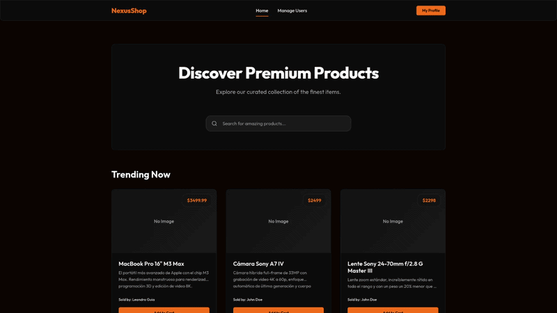
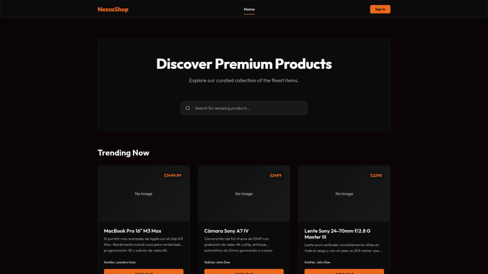
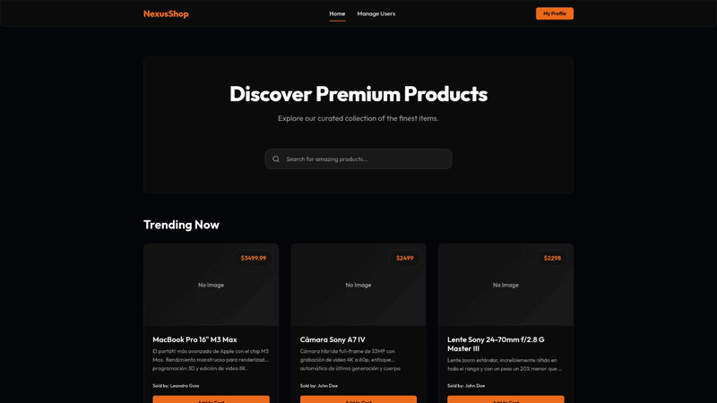
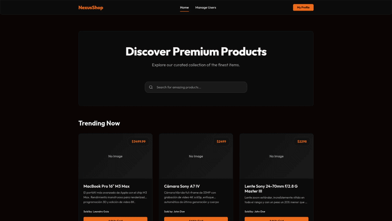
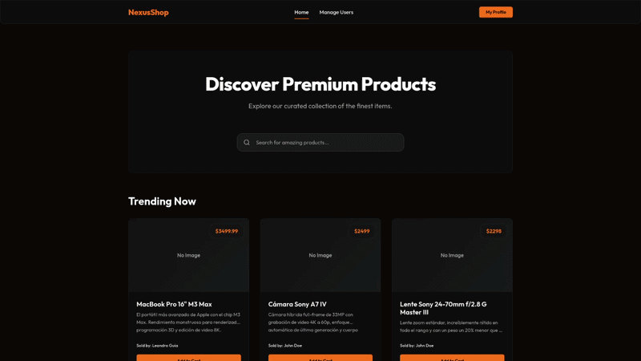
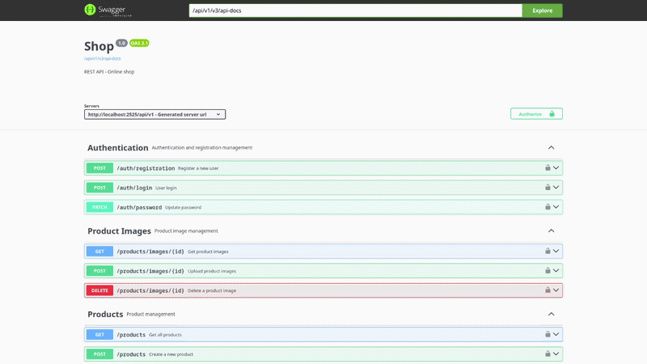

<div align="center">

# E-Commerce API & Management System

> **Un sistema de gestión y backend de comercio electrónico robusto, seguro y escalable desarrollado con Java 25, Spring Boot 4 y Spring Security.**

[](https://java.com/)
[](https://spring.io/projects/spring-boot)
[](https://spring.io/projects/spring-security)
[](https://www.mysql.com/)
[](https://jwt.io/)
[](https://cloudinary.com/)
[](https://swagger.io/)

</div>

---

## Acerca del Proyecto

Este proyecto es una plataforma integral de E-Commerce diseñada para demostrar buenas prácticas en el desarrollo backend moderno. Cuenta con una API RESTful completa construida sobre **Spring Boot**, autenticación segura utilizando **JSON Web Tokens (JWT)** y gestión dinámica de imágenes a través de **Cloudinary**. 

La arquitectura se adhiere estrictamente a los **principios SOLID**, utilizando objetos de transferencia de datos (DTO) a través de **MapStruct** para un enlace de datos limpio y **Lombok** para reducir el código repetitivo, asegurando una alta mantenibilidad y rendimiento.

### Características Técnicas Destacadas
- **Autenticación y Autorización Segura**: Implementación de autenticación sin estado (stateless) usando JWT y Spring Security. El control de acceso basado en roles (RBAC) separa a los usuarios estándar de los administradores.
- **Gestión de Medios en la Nube**: Integración con la API de Cloudinary para la carga optimizada y el alojamiento fluido de las imágenes de los productos.
- **Documentación Automatizada de API**: Documentación de endpoints interactiva generada automáticamente mediante SpringDoc OpenAPI (Swagger).
- **Arquitectura Limpia**: Separación de responsabilidades mediante el patrón de capas Controller-Service-Repository. Encapsulación de datos empleando DTOs y MapStruct.
- **Persistencia de Datos**: Gestión de base de datos relacional mediante Spring Data JPA e Hibernate junto a MySQL.

---

## Consumo de la API en un proyecto de prueba

A continuación se presentan demostraciones de las funcionalidades principales.

### 1. Pantalla de Inicio (Home)
> ****

### 2. Autenticación de Usuario (Login)
> ****

### 3. Búsqueda de Productos
> ****

### 4. Edición de Productos y Subida de Imágenes
> ****

### 5. Panel de Administrador
> ****

### 6. Documentación de la API (Swagger)
> *Recorrido por la documentación interactiva de endpoints utilizando SpringDoc OpenAPI.*
>
> ****

---

## Stack Tecnológico y Herramientas

* **Framework Backend:** Java 25, Spring Boot 4.1.0
* **Seguridad:** Spring Security, JWT (jjwt 0.12.6)
* **Base de Datos y ORM:** MySQL, Spring Data JPA, Hibernate
* **Mapeo y Reducción de Código:** MapStruct, Lombok
* **Almacenamiento en la Nube:** Cloudinary
* **Documentación de API:** SpringDoc OpenAPI (Swagger UI 3.0.0)
* **Herramienta de Construcción:** Maven

---

## Guía de Instalación

Para obtener una copia local y ponerla en funcionamiento, sigue estos pasos:

### Requisitos Previos

* Java 25 instalado
* Maven instalado
* Servidor MySQL en ejecución
* Una cuenta en [Cloudinary](https://cloudinary.com/) para la subida de imágenes

### Instalación

1. **Clonar el repositorio**
   ```sh
   git clone https://github.com/tu-usuario/shop.git
   ```
2. **Configurar las Variables de Entorno**
   Actualiza tu archivo `application.properties` o `application.yml` en la ruta `src/main/resources` y configura las credenciales de tu base de datos y Cloudinary:
   ```properties
   # Configuración de Base de Datos
   spring.datasource.url=jdbc:mysql://localhost:3306/...
   spring.datasource.username=
   spring.datasource.password=
   spring.jpa.hibernate.ddl-auto=

   # Secreto JWT
   jwt.secret=
   jwt.expiration=

   # Configuración de Cloudinary
   cloudinary.cloud_name=
   cloudinary.api_key=
   cloudinary.api_secret=
   ```
3. **Compilar y ejecutar la aplicación**
   ```sh
   mvn clean install
   mvn spring-boot:run
   ```

---

## Documentación de la API

Una vez que la aplicación esté en ejecución, puedes acceder a la interfaz interactiva de Swagger para explorar y probar los endpoints:

**URL de Swagger UI:** `http://localhost:8080/swagger-ui.html`

*(Nota: Asegúrate de incluir el token Bearer JWT en el encabezado de autorización de Swagger al probar los endpoints protegidos).*

---

## Autor

**Leandro**
* [LinkedIn](https://www.linkedin.com/in/leandro-guia-dev)
* [GitHub](https://github.com/leanx22)
* [Portfolio](https://leandroguia.com)
